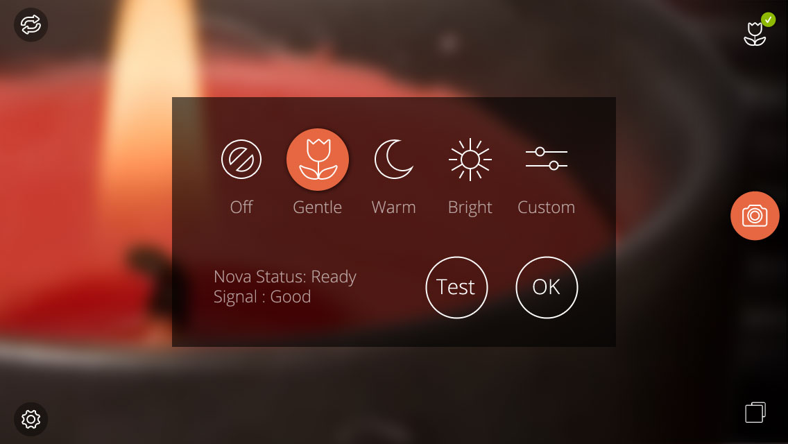

Official Nova Camera App for Android
====================================

See:
*    https://wantnova.com/ <-- Nova flash
*    https://wantnova.com/play <-- Get the app from Google Play

About Nova
----------

Nova is a slim, wireless flash in your wallet and transform your photos with great light. Nova provides 40 warm and cool LEDs gently diffused to create natural looking lighting for photography.

This is the official camera app for Nova.

Requires Android 4.3 or greater and a phone/tablet that supports Bluetooth Low Energy.

Key features:
*   Dual tone flash: control brightness of warm and cool LED banks with simple presets
*   Automatic pairing with Nova device: just launch the app!
*   Ergonomic triggering of camera using physical volume buttons 
*   Easy reviewing and sharing of photos
*   Uses Android intentions to integrate with the rest of your other Android apps. Use it with Twitter, Google+, Facebook, SnapSeed, Aviary and more

This camera app produces the best photos in combination with the Nova off-camera flash. To learn more, visit https://wantnova.com/

Requirements
------------

You will need a real Android device that runs 4.3 (or later), has a camera and BluetoothLE hardware.

Known to work:
*   Google Nexus 4, 5
*   HTC One
*   Samsung Galaxy S4, S5

Don't even bother attempting with the Android emulator, it's too slow and painful.

Building
--------

1.  Install and open [Android Studio](http://developer.android.com/sdk/installing/studio.html)
2.  Import project (point to local clone of this repository)
3.  Make project

Authors
-------

* [Luke Hunter](https://github.com/lukehunter)
* [Joe Walnes](https://github.com/joewalnes)

